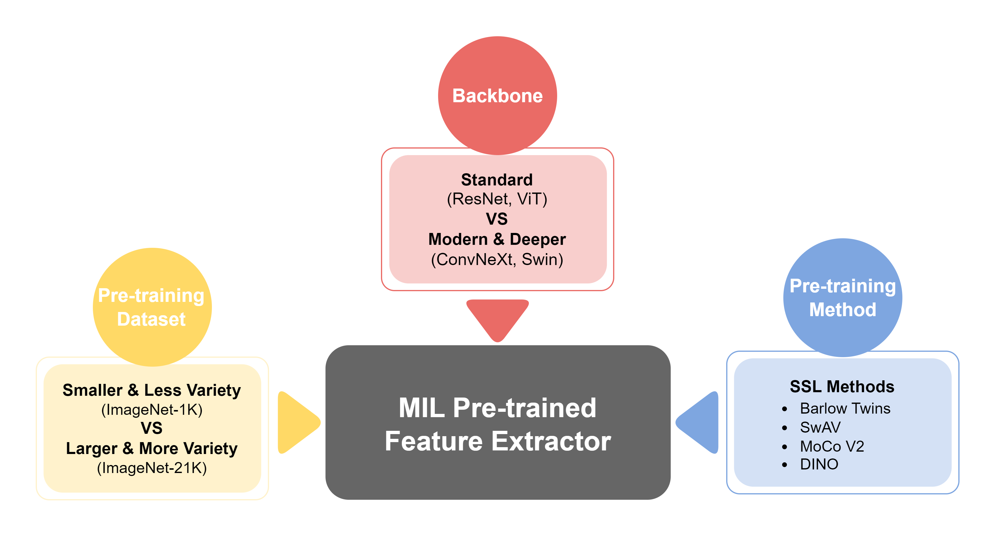

<h1 align="center"> Rethinking Pre-trained Feature Extractor Selection in Multiple Instance Learning for Whole Slide Image Classification </h1>

**Under Submission Review for ISBI 2025**

<p align="center">
  
</p>

## Environments
- Linux Ubuntu 20.04.6
- 2 NVIDIA A100 GPUs (40GB each)
- CUDA version: 12.2
- Python version: 3.9.18

## Installation

Install [Anaconda](https://www.anaconda.com/download#)<br>
Create a new environment and activate it

```bash
conda create --name mil_feat_ext python=3.9.18
conda activate mil_feat_ext
````

Install all required packages
```bash
pip install -r requirements.txt
pip install torch==1.13.1+cu117 torchvision==0.14.1+cu117 --extra-index-url https://download.pytorch.org/whl/cu117
pip install timm-0.5.4.tar
````

## Dataset Preparation

A. TCGA-NSCLC (Lung Cancer) → Provided by [DSMIL](https://github.com/binli123/dsmil-wsi), it can be download directly in both 2.5x and 10x magnifications from the following [link](https://drive.google.com/file/d/17zCn-WRNzxxxh8kkdBTbDLDZy0XZ3RIu/view)

B. Camelyon16 → The [HS2P](https://github.com/clemsgrs/hs2p) project, build on [CLAM](https://github.com/mahmoodlab/CLAM) is utilized for standardized tissue patch extraction. Following default configuration file `config/extraction/default.yaml` from the HS2P, below are the most important configurations to note:
- spacing: 0.5 µm/px (~20x magnification)
- tissue_thresh: 0.1
- patch_size: 256
- save_patches_to_disk: True

We follow the official train/test split on the [Camelyon16 dataset](https://camelyon16.grand-challenge.org/Data/) and take the first 836 entries in `datasets_csv/tcga-nsclc.csv` for training and the remaining 210 entries for testing

Below is the example of the TCGA-NSCLC dataset structure after splitting into classes and train/test:

<details>
<summary>
Folder structure
</summary>

```bash
<datasets>/
├── data_tcga_lung_tree/
    ├── train/
        ├── LUAD/
            ├── TCGA-4B-A93V-01Z-00-DX1/
                ├── x1_y1
                    ├── x11_y11.png
                    ├── x12_y12.png
                ├── x2_y2.png
                ├── x3_y3.png
                ├── ...
            ├── ...
        
        ├── LUSC/
            ├── TCGA-18-3408-01Z-00-DX1/
                ├── x4_y4
                    ├── x41_y41.png
                    ├── x42_y42.png
                ├── x5_y5.png
                ├── x6_y6.png
                ├── ...
            ├── ...
        
    ├── test/
        ├── ...
                
```
</details>


## Feature Extraction

Create a config file under `feature_extraction/configs/` with the name as follows: `[name of backbone]-[name of pre-training method]-[name of pre-training dataset].yaml`. Below are the examples of config file names:
- resnet50-supervised-imagenet1k ([Timm](https://github.com/huggingface/pytorch-image-models))
- swin_base-supervised-imagenet21k ([Timm](https://github.com/huggingface/pytorch-image-models))
- vit_small16-ssl-dino-imagenet1k ([PyTorch Hub](https://github.com/pytorch/hub))
- resnet50-lunit-ssl-barlow_twins-tcga-tulip ([Benchmark SSL Pathology](https://github.com/lunit-io/benchmark-ssl-pathology))

A good starting point is to follow the config file below (e.g., `resnet50-supervised-imagenet1k.yaml`), making changes only to the sections marked with '#CHANGE' comments (see `feature_extraction/configs/` for more details)

<details>
<summary>
Config File
</summary>

```bash
gpu_id: 0 # CHANGE

# Output settings
output_dir_path: 'outputs'
feature_extractor: 'resnet50-supervised-imagenet1k-transform' # CHANGE
resume: False # CHANGE

# Dataset settings
dataset:
  name: 'tcga-nsclc' # CHANGE: ['tcga-nsclc', 'camelyon16']
  patch_size: 224 # CHANGE
  base_folder_path: '../../feature_extractor_MIL_study/datasets/data_tcga_lung_tree'  # CHANGE
  slide_data_path: 'slide_data/${dataset.name}.csv'
  extracted_summary_path: '../datasets_csv/${dataset.name}/${feature_extractor}.csv'
  slide_missing_path: 'slide_missing/${dataset.name}.csv'
  subsets:
  - train
  - test
  classes: # CHANGE
  - LUAD
  - LUSC
  
# Model settings
model:
  backbone: 'resnet50' # CHANGE
  feats_dim: 1024 # CHANGE
  kernel_size:
  trained_path:

# Feature Extraction settings
feature_extraction:
  save_patch_features: False # CHANGE
  normalization: 'imagenet' # CHANGE: ['imagenet', 'lunit']
  stain_norm_macenko: False
 
 ```
 </details>
 
 To kick off the feature extraction process using `resnet50-supervised-imagenet1k` features
 
 ```bash
cd feature_extraction/
python extract_features.py --config-name resnet50-supervised-imagenet1k
````

This will result in the slide features being stored under `feature_extraction/outputs/tcga-nsclc/resnet50-supervised-imagenet1k/`


## MIL Aggregator Training

Below are the useful arguments to train MIL models

 ```bash
seed                # Seed to reproduce experiments
device              # Which GPU for training
num_classes         # Depends on the number of positive classes (e.g., camelyon16: 1, tcga-nsclc: 2)
feature_extractor   # Name of the feature extractor used
feats_size          # Dimension of the feature vector
model               # Which MIL model to use ['abmil', 'dsmil', 'transmil', 'DTFD']
distill             # Only Used for DTFD-MIL ['MaxMinS', 'MaxS', 'AFS']
````

To train all four SOTA MIL models with 3 times running (e.g., seed 0, 5, 10) using the previously extracted features (e.g., resnet50-supervised-pretrained-imagenet-1k) is as below (refer to `train.sh`):

 ```bash
cd ..

python train_abmil_dsmil.py --seed 0 --device cuda:0 --num_classes 2 --dataset tcga-nsclc --feature_extractor resnet50-supervised-imagenet1k --feats_size 1024 --model abmil
python train_abmil_dsmil.py --seed 0 --device cuda:0 --num_classes 2 --dataset tcga-nsclc --feature_extractor resnet50-supervised-imagenet1k --feats_size 1024 --model dsmil
python train_transmil.py --seed 0 --device cuda:0 --num_classes 2 --dataset tcga-nsclc --feature_extractor resnet50-supervised-imagenet1k --feats_size 1024 --model transmil
python train_dtfdmil.py --seed 0 --device cuda:0 --num_classes 2 --dataset tcga-nsclc --feature_extractor resnet50-supervised-imagenet1k --feats_size 1024 --model DTFD --distill MaxMinS

python train_abmil_dsmil.py --seed 5 --device cuda:0 --num_classes 2 --dataset tcga-nsclc --feature_extractor resnet50-supervised-imagenet1k --feats_size 1024 --model abmil
python train_abmil_dsmil.py --seed 5 --device cuda:0 --num_classes 2 --dataset tcga-nsclc --feature_extractor resnet50-supervised-imagenet1k --feats_size 1024 --model dsmil
python train_transmil.py --seed 5 --device cuda:0 --num_classes 2 --dataset tcga-nsclc --feature_extractor resnet50-supervised-imagenet1k --feats_size 1024 --model transmil
python train_dtfdmil.py --seed 5 --device cuda:0 --num_classes 2 --dataset tcga-nsclc --feature_extractor resnet50-supervised-imagenet1k --feats_size 1024 --model DTFD --distill MaxMinS

python train_abmil_dsmil.py --seed 10 --device cuda:0 --num_classes 2 --dataset tcga-nsclc --feature_extractor resnet50-supervised-imagenet1k --feats_size 1024 --model abmil
python train_abmil_dsmil.py --seed 10 --device cuda:0 --num_classes 2 --dataset tcga-nsclc --feature_extractor resnet50-supervised-imagenet1k --feats_size 1024 --model dsmil
python train_transmil.py --seed 10 --device cuda:0 --num_classes 2 --dataset tcga-nsclc --feature_extractor resnet50-supervised-imagenet1k --feats_size 1024 --model transmil
python train_dtfdmil.py --seed 10 --device cuda:0 --num_classes 2 --dataset tcga-nsclc --feature_extractor resnet50-supervised-imagenet1k --feats_size 1024 --model DTFD --distill MaxMinS
````

## Acknowledgement

Our code is mainly built from these amazing works [IBMIL](https://github.com/HHHedo/IBMIL), [ABMIL](https://github.com/AMLab-Amsterdam/AttentionDeepMIL), [DSMIL](https://github.com/binli123/dsmil-wsi), [TransMIL](https://github.com/szc19990412/TransMIL), [DTFD-MIL](https://github.com/hrzhang1123/DTFD-MIL), [HS2P](https://github.com/clemsgrs/hs2p), [Re-implementation HIPT](https://github.com/clemsgrs/hipt)
